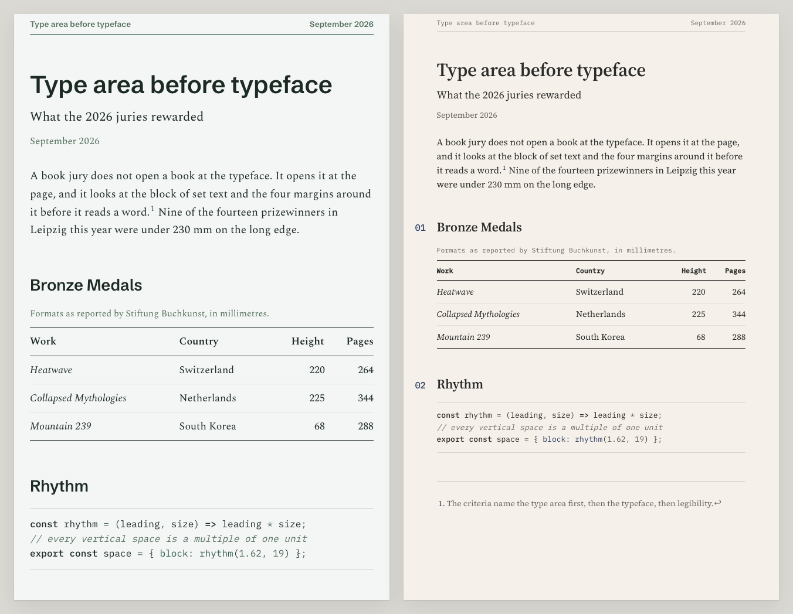
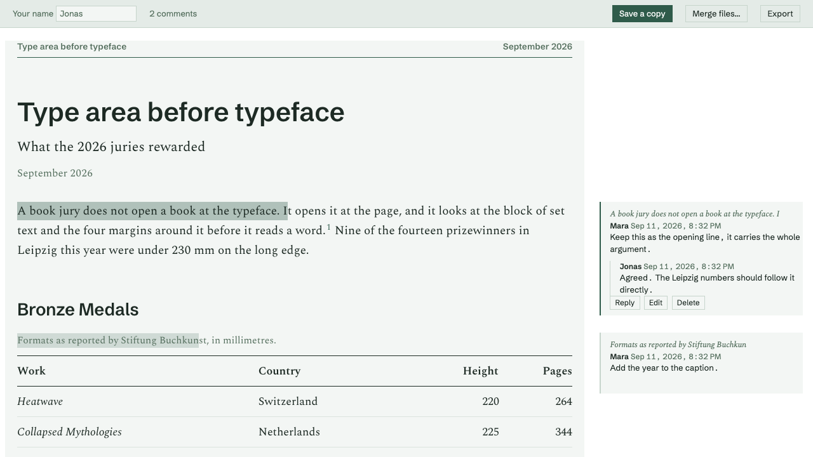

# Satzspiegel

Markdown is where the thinking happens now. AI assistants write their plans and research in it, notes apps store it, every repository is full of it. Sharing it is where it breaks. The raw file is unreadable to anyone without an editor. Rendered on GitHub it needs an account. Pasted into Word it loses its structure, exported to PDF it looks like a default, and the review comes back as an email thread that never finds its way into the source.

Satzspiegel turns a Markdown file into a page set like a book, with one command. And the same page can carry your readers' comments back to you.



## One command

Install [Pandoc](https://pandoc.org/installing.html) once, on Mac, Windows or Linux. Then, on Mac or Linux:

```bash
git clone https://github.com/yobu/satzspiegel.git && cd satzspiegel && make install
```

On Windows, in PowerShell, the install script does the same copies (it needs [Git for Windows](https://git-scm.com/download/win), or download the repository as a zip and unpack it):

```powershell
git clone https://github.com/yobu/satzspiegel.git; cd satzspiegel; powershell -ExecutionPolicy Bypass -File install.ps1
```

From then on, anywhere on your machine:

```bash
pandoc plan.md -d satzspiegel -o plan.html
```

Open `plan.html`. That is the whole workflow.

## Send it, and get it back with comments

Render the review edition instead:

```bash
pandoc plan.md -d satzspiegel-review -o plan.html
```

That is one file, and it needs nothing installed on the other side. This is what the reviewer sees after two comments and a reply:



```
  you                                              your reviewer
  ───                                              ─────────────
  pandoc plan.md -d satzspiegel-review
        │
        │  plan.html, one file
        ├──── mail, chat or a shared drive ──────▶  opens it, even offline
        │                                           selects a passage, writes a comment
        │                                           replies, edits, deletes
        │                                           Save a copy  →  plan.annotated.html
        ◀──────────── sends it back ────────────────────┘
        │
  opens plan.annotated.html
  the comments sit beside the passages they belong to
  Merge files…  adds the copies from other reviewers
  Export        gives the comments as a Markdown list to work from
```

The comments are stored inside the file, in the [W3C Web Annotation](https://www.w3.org/TR/annotation-html/) format, so they travel with it and any tool that reads that format can read them. There is no server and no account. Nothing leaves anyone's machine. It works in current Chrome, Edge, Safari and Firefox.

Try it on this page: [readme-review.html](readme-review.html) is this README as a review edition. Comment on it, save a copy, send it back.

## The switches

Each one is a word on the command line, and each does one thing.

- `-d satzspiegel` makes the plain page. It links the stylesheet and fonts from this repository, so it needs a network connection to look right.
- `-d satzspiegel-review` makes the page people can comment on. It is self-contained: about 1.1 MB, because the four typefaces are inside it.
- `-V nofonts` leaves the typefaces out. The page uses the fonts already on the reader's computer instead, and the file shrinks to about 90 KB. Use it when size matters more than the exact look.
- `-V theme=archive` switches from Patina, a serif with a grotesk for headings, to Archive, a smaller serif with numbered sections and typewriter-style labels.
- `-V nocolophon` removes the faint "Set with Satzspiegel" line at the foot of every page.
- `-V measure=72ch` makes the text column narrower, or wider with a bigger number, for one document.
- `--embed-resources` makes the plain page self-contained too, so it can be sent like the review edition.

They combine: `pandoc plan.md -d satzspiegel-review -V nofonts -V theme=archive -o plan.html`.

## Why it looks the way it does

*Satzspiegel* is the German word for the type area: the block of set text and its relationship to the four margins. Book design juries judge that first and the typeface second. The decisions in this stylesheet come from what the 2025 and 2026 juries rewarded, at Stiftung Buchkunst in Leipzig and Frankfurt, the Dutch and Swiss book competitions, AIGA, the Type Directors Club and D&AD: the column before the face, one spot colour used for structure, rules that are hairlines and horizontal, three heading sizes and then depth by style. The survey is in [docs/rationale.md](docs/rationale.md), and the [plates](plates/plates.html) show every component decision with its reason. The typefaces are Spectral, Schibsted Grotesk, Source Serif 4 and IBM Plex Mono, all under the SIL Open Font License and served from here.

## Before you send

- **Mail filters.** Many mail systems quarantine HTML attachments that contain a script, and the review edition contains one. Zip the file first, or share it through a drive or a chat, and test the route once with your own address.
- **Windows and Linux.** Pandoc runs on both, and everything here is plain files. `make install` on Mac and Linux and `install.ps1` on Windows make the same four copies.
- **Privacy.** The fonts are served from this repository, not from a third party, and the review edition never contacts a server.

## Everything else

The [usage guide](docs/usage.md) covers using the stylesheet without Pandoc, the code module, the opt-in classes, the typefaces and their licences, the command-line tool for returned review files, and the repository layout. The stylesheet, template and scripts are MIT; the typefaces keep their own licence.
