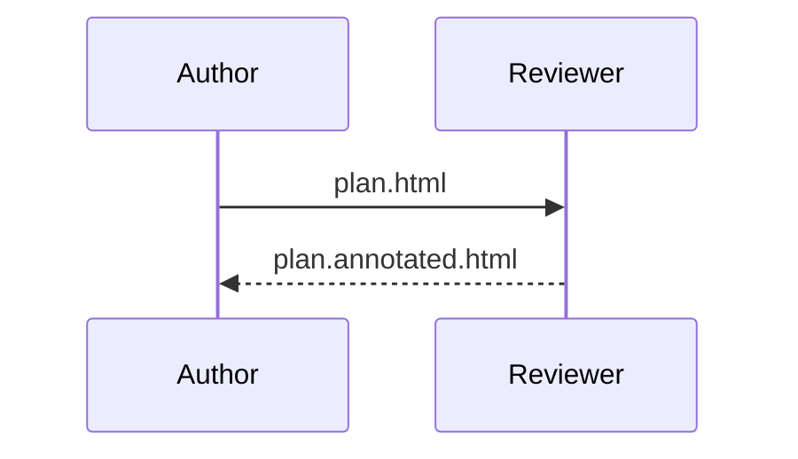
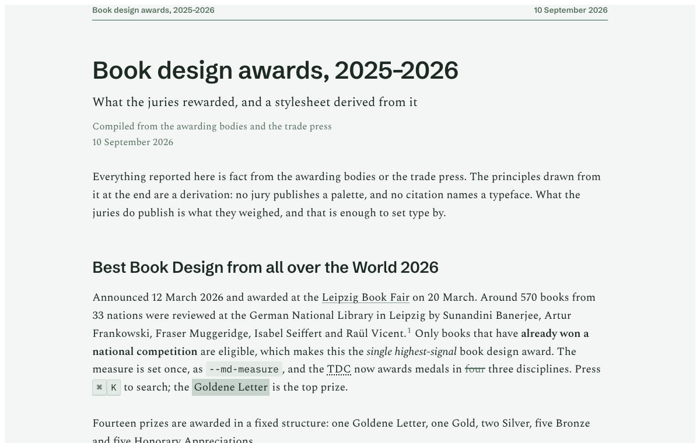
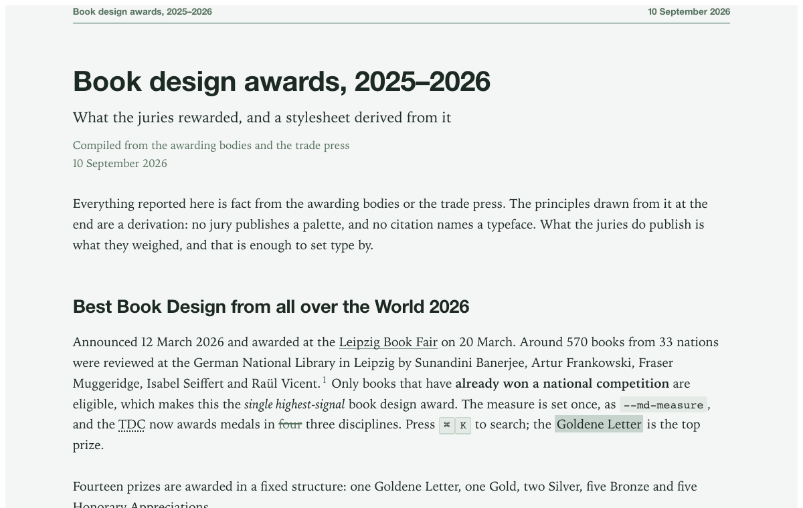

The [README](../README.md) tells the story and gives the two commands. This guide is the reference: every way to run it, every switch, every class, and the licences.

## Pandoc, in full

`make install` copies four kinds of file into Pandoc's user data directory (`pandoc --version` prints it; on a Mac it is `~/.local/share/pandoc`): the HTML template, the defaults files, the Lua filter, and, into `~/.local/share/satzspiegel`, the stylesheets and fonts for offline use. Afterwards these defaults files exist:

| Defaults file | Input | Output |
|:--|:--|:--|
| `satzspiegel` | Pandoc Markdown | plain page, stylesheet and fonts linked from GitHub Pages |
| `satzspiegel-gfm` | GitHub-flavoured Markdown | the same, for READMEs, issues and chat exports |
| `satzspiegel-review` | Pandoc Markdown | self-contained review edition with the comment layer |
| `satzspiegel-review-light` | Pandoc Markdown | the review edition without the typefaces |
| `*-local` | as above | the same four, with the stylesheet and fonts taken from the local install; use with `--embed-resources` for offline rendering |

Pandoc Markdown reads footnotes, definition lists, task lists, pipe tables, fenced divs, implicit figures, smart punctuation, GitHub alerts and `==marks==`; the defaults files turn all of these on. Mathematics renders as MathML, so equations need no script. A small Lua filter wraps every table in a scrolling container, labels its cells for the stacked-table variant, and draws the diagrams (see [Images and diagrams](#images-and-diagrams)).

Without `make install`, Pandoc can take the template by URL and the stylesheets by URL; only the filter must be local. The template links the typefaces only when it is told where they are, so pass `fonts.css` as the first stylesheet:

```bash
pandoc doc.md -s --template=https://yobu.github.io/satzspiegel/pandoc/templates/satzspiegel.html \
  -c https://yobu.github.io/satzspiegel/fonts.css \
  -c https://yobu.github.io/satzspiegel/satzspiegel.css \
  -c https://yobu.github.io/satzspiegel/satzspiegel-code.css \
  -o doc.html
```

Variables, on the command line as `-V name` or `-V name=value`, or in the document's YAML front matter:

| Variable | Effect |
|:--|:--|
| `theme` | `patina` (default) or `archive` |
| `nofonts` | leave the typefaces out; the system stacks are used instead |
| `nocolophon` | no "Set with Satzspiegel" line at the foot |
| `measure` | the text column width for this document, for example `72ch` |
| `review` | include the comment layer; set by the review defaults files |
| `md-class` | extra classes on the `.md` element, for example `md--indent md--justified` |
| `repo` | a GitHub repository, `owner/name`, linked in the running head next to a GitHub star button; the button loads GitHub's `buttons.github.io` script, so use it on web pages, not on documents you send |

## Images and diagrams

Images need nothing. In a self-contained file (every review edition, or any page rendered with `--embed-resources`) Pandoc writes each image into the file, whether the Markdown names a local path or an `https` address, so what you send is complete. In a linked page the path stays as you wrote it and has to resolve from where the HTML ends up; `--resource-path` tells Pandoc where else to look, and `--embed-resources` removes the question. A paragraph holding only an image becomes a figure with its caption, `{width=60%}` sizes it, and a figure may break out of the column where the page has a margin to give.

Diagrams are drawn when the page is rendered, not when it is opened. A fenced `mermaid` block goes through [mermaid-cli](https://github.com/mermaid-js/mermaid-cli) and arrives in the page as an SVG image, written into the HTML itself. The file stays one file, opens offline, gains a few kilobytes per diagram instead of a three-megabyte script, and the review edition still carries exactly one script.

```bash
npm install -g @mermaid-js/mermaid-cli
```

Then, in the Markdown:

````markdown

````

- The diagram takes the theme: paper, ink, hairlines and the spot of Patina or Archive, a sans face in Patina and a monospace in Archive. Both are system faces, because an SVG shown as an image cannot reach the page's typefaces, and labels measured on your machine have to fit on the reader's.
- A diagram keeps the size it was drawn at, so its labels stay at reading size. One that is wider than the column scrolls sideways inside its figure, as a wide table does; a long chain reads better as `flowchart TD` than `LR`. `width=60%` on the block scales it instead, and print always fits it to the page.
- `%%| caption:` makes it a captioned figure and `%%| alt:` gives the image its description; both also work as attributes in Pandoc Markdown, ```` ```{.mermaid caption="…" alt="…" width=60%} ````. The comment form survives the GFM reader, which has no attributes.
- A block that starts with its own `%%{init: …}%%` directive or a `---` front matter keeps its own configuration. Set `htmlLabels: false` there, or some browsers will draw the boxes without their words.
- Without `mmdc` on the `PATH` the block stays a code block, and Pandoc says once how to install it. `MERMAID_BIN` names the program if it lives elsewhere.
- Drawing starts a headless browser and takes a few seconds per diagram, so results are kept in `~/.cache/pandoc-diagram-filter` and an unchanged diagram costs nothing on the next render. `diagram: {cache: false}` in the front matter turns that off.
- The work is done by the Pandoc project's [diagram filter](https://github.com/pandoc-ext/diagram), release 1.2.0, shipped unmodified as `satzspiegel-diagram.lua` under its MIT licence and verified by checksum in `make check`. It also draws `dot` (Graphviz), `plantuml`, `tikz`, `asymptote` and `cetz` blocks when their programs are installed; only mermaid is themed. To show such source as code instead, put another class first: ```` ```{.text .mermaid} ````.
- In a review edition the labels of a diagram cannot be commented on, by design: as an image they stay out of the text the comments anchor to. Comment on the caption or the sentence beside it.

Pandoc is available for Windows (`winget install JohnMacFarlane.Pandoc`, Chocolatey, or the MSI installer), Linux (a deb and tarball on the release page, and most distribution repositories, which may lag) and macOS (`brew install pandoc`). Docker images and GitHub Actions examples exist on the Pandoc site. On Windows, `install.ps1` does what `make install` does, into `%APPDATA%\pandoc` and `%LOCALAPPDATA%\satzspiegel`.

## The review edition, in detail

The review edition adds a small script and stylesheet to the page and an empty annotation block. Whoever opens the file can select text and comment, reply, edit and delete, and press **Save a copy**, which writes `doc.annotated.html` with the comments inside. In Chrome and Edge the file can also be overwritten in place; every other browser saves a new copy to the downloads folder.

Comments are W3C Web Annotations, JSON-LD in a `<script>` element of the type the W3C note [Embedding Web Annotations in HTML](https://www.w3.org/TR/annotation-html/) prescribes. Each comment anchors to its passage with a `TextQuoteSelector`, the quoted text plus a little context on either side, and a `TextPositionSelector` as a hint. Anchors survive a different window width and a re-render from edited Markdown as long as the quoted passage still exists; a passage that changed is listed as not found rather than lost. Replies are annotations whose target is the parent's id.

Highlights use the CSS Custom Highlight API, which never touches the document's markup: Chrome and Edge 105, Safari 17.2 and Firefox 140 or later. Older browsers list every comment with its quote and skip the highlight.

**Merge files…** reads the annotation blocks of other saved copies and adds their comments to the open document, skipping any already present, then re-anchors them. It changes nothing on disk; save a copy afterwards. **Export** writes the comments as JSON-LD or as a Markdown list of quotes and comments.

On the command line, `scripts/annotations.mjs` does the same without a browser:

```bash
node scripts/annotations.mjs review/*.annotated.html > comments.md
node scripts/annotations.mjs --json a.annotated.html b.annotated.html > all.json
node scripts/annotations.mjs --merge-into doc.html a.annotated.html b.annotated.html
```

### Sending it by mail

Many mail systems quarantine or strip HTML attachments that contain a script, and the review edition contains one. Corporate Outlook and Gmail both do this on some settings.

- **Zip it.** `zip doc.zip doc.html` on a Mac or Linux, or right-click and Compress in the Finder, or Send to, Compressed folder in Windows Explorer. A zipped HTML file passes where a bare one is blocked, and the reviewer double-clicks to unpack it. Ask for the annotated copy back the same way.
- **Share a link instead.** A shared drive, SharePoint, Nextcloud or a chat upload sidesteps mail filtering, and the reviewer downloads the file and opens it locally.
- **Test once.** Send yourself a review edition through the same mail system your colleagues use before relying on it.

## The stylesheet without Pandoc

```html
<link rel="stylesheet" href="https://yobu.github.io/satzspiegel/fonts.css"><!-- leave out for system fonts -->
<link rel="stylesheet" href="https://yobu.github.io/satzspiegel/satzspiegel.css">
<link rel="stylesheet" href="https://yobu.github.io/satzspiegel/satzspiegel-code.css"><!-- optional -->

<div class="md-host">
  <main class="md" data-md-theme="patina">
    <!-- rendered markdown -->
  </main>
</div>
```

For a pinned, cached copy use jsDelivr: `https://cdn.jsdelivr.net/gh/yobu/satzspiegel@1/satzspiegel.css`. The `.md-host` wrapper is what the container queries measure; without it the marginalia column and the stacked table never engage. The stylesheet uses cascade layers, so your own unlayered rules win.

Two things a pipeline should emit to unlock the full set: wrap tables in `<div class="md-table-scroll">`, and put `data-label` on each `td` for `.md-table--stack`. Both are one-line plugins in remark, markdown-it and Kramdown, and the Pandoc filter does them for you. The stylesheet reads both GFM markup (remark, markdown-it) and Pandoc's: footnotes, task lists, alerts, code with line numbers, and the title block.

## The two themes

|                | Patina, the default                     | Archive                                   |
|:---------------|:----------------------------------------|:------------------------------------------|
| Register       | A sculpture-garden catalogue            | An archival index card                    |
| Text face      | Spectral, 19 px, leading 1.62           | Source Serif 4, 15.5 px, leading 1.55     |
| Display face   | Schibsted Grotesk                       | Source Serif 4                            |
| Apparatus      | Schibsted Grotesk                       | IBM Plex Mono                             |
| Measure        | 93 ch, about 884 px                     | 106 ch, about 855 px                      |
| Paper / ink    | #F3F6F4 / #1D2A24                       | #F5F1EA / #2B2B2A                         |
| Spot           | Patina green #2F5B4A, 7.1 : 1           | Archival ink #2F3E63, 9.4 : 1             |
| Device         | Footnotes in an outer column above 86 rem | Sections numbered in the margin         |

Every text colour is at least 4.5 : 1 against the paper. The [specimen](../specimen.html) shows every component in both themes with the option toggles.

## The code module

`satzspiegel-code.css` is optional. Without it a fenced block is a quiet set block in the mono face between two rules, which is how a book sets code and is often the better choice. With it: six syntax roles in one forme, line numbers that survive syntax tokens, a filename head set as a caption, diff rows, and class maps for Pandoc's highlighter, Prism, highlight.js and Shiki's css-variables theme. Add `md--nocode` to hide fenced blocks entirely.

## Opt-in classes

| Class | On | Effect |
|:--|:--|:--|
| `md--indent` | `.md` | Book paragraph model: first-line indent, no space between paragraphs |
| `md--justified` | `.md` | Justified setting with hyphenation |
| `md--tinted-alerts` | `.md` | One hue per alert severity instead of the single forme |
| `md--nocode` | `.md` | Hide fenced code |
| `md-table--compact`, `md-table--numeric`, `md-table--zebra`, `md-table--stack` | `table` | Density, tabular figures on the whole body, striping, stacked rows on narrow screens |
| `md-ol-nested` | `ol` | Legal numbering 1 → 1.1 → 1.1.1 |
| `md-dl-columns` | `dl` | Two-column glossary |
| `md-pull` | `blockquote` | Pull quote |
| `md-runin` | `h4` | Run-in heading |
| `md-code--numbered`, `md-code--wrap` | `pre` | Line numbers, soft wrap |

In Pandoc Markdown a class goes in braces after a heading (`#### Note {.md-runin}`) or at the end of a table caption (`: Caption {.md-table--compact}`); `-V md-class="md--indent"` sets classes on the whole document.

## Typefaces, and leaving them out

Spectral, Schibsted Grotesk, Source Serif 4 and IBM Plex Mono are served from this repository as Latin and Latin Extended WOFF2 subsets, 765 KB in all, each with its SIL Open Font License in `fonts/<family>/OFL.txt`. They live in their own stylesheet, `fonts.css`, which the template links before `satzspiegel.css`. Every `@font-face` lists `local()` first, so a reader who has the face installed uses their own copy, and nothing is fetched from a third party. A browser downloads only the faces and subsets a page uses: 3 to 6 files, 70 to 140 KB, for the examples in this repository. `node scripts/fetch-fonts.mjs` regenerates the set.

A self-contained file packs all 22 font files, and they are almost the whole file. `-V nofonts` leaves them out; the page then uses the system stacks declared in the stylesheet: Iowan Old Style or Palatino for the serif, Helvetica for the headings, Georgia in Archive, the system monospace for code. Readers who have the four families installed still get them.

| sample.md, self-contained | With fonts | Without |
|:--|--:|--:|
| Review edition | 1,114 KB | 86 KB |
| Plain edition | 1,070 KB | 41 KB |
| Review edition, zipped | 816 KB | 21 KB |

The same page both ways, on a Mac. Left with the typefaces, right in the system fallbacks:

<p> </p>

## Repository

```
satzspiegel.css         tokens for both themes, the component layer, the layouts
satzspiegel-code.css    optional code module
fonts.css  fonts/       typefaces and licences                    (make fonts)
pandoc/                 template, defaults files, Lua filters, review layer  (make install)
sample.md               every object a Markdown pipeline emits  (make sample, make review)
examples/               six documents that exercise the set     (make examples)
scripts/                font fetcher; annotation extractor for returned review files
index.html              the README, rendered                    (make readme)
readme-review.html      the README as a review edition          (make readme)
specimen.html           every component with a theme switcher
plates/                 the design plates and the Claude Design canvas that settled the set
docs/                   this guide, the award survey, the images
```

`make` lists every target. `make check` runs the contrast check on both palettes, renders every kind of page, verifies that the review editions really embed their script and stylesheet, and reads a review edition back with the extractor; CI runs the same target on a checksum-pinned Pandoc. `make verify-fonts` checks the font files against `fonts/SHA256SUMS`, which `make fonts` rewrites after confirming every download is a WOFF2 file from Google's font host. `make site` assembles the GitHub Pages site into `_site`. Versioning follows semver; tags are `v1.0.0` and so on. Changes to a theme go into its token block and are re-shot on the plates before release.

What the review layer trusts: nothing. Comment text, names and quotes are written into the page as text, never as markup; the annotation payload written into the file has every `<` escaped, so no comment can close the script element; and a merged file contributes only items that have the shape the layer writes. Files named `*.annotated.html` and `*.merged.html` are ignored by git, so a returned review never lands in a commit by accident.

## Licence

MIT for the stylesheet, template, filter, review layer and scripts: use, copy, change and redistribute, with the notice kept. The diagram filter in `pandoc/filters/satzspiegel-diagram.lua` is the work of Albert Krewinkel and contributors, also MIT; its notice is beside it.

The typefaces are under the SIL Open Font License 1.1, and that licence is what allows them to be hosted here, served from GitHub Pages and a CDN, and embedded in the files you produce. Three points from the licence and its FAQ shape how they are shipped:

- A subset is a Modified Version. The files here are Latin and Latin Extended subsets, so they are modified fonts, which the OFL permits as long as the licence text travels with them; it does, in `fonts/<family>/OFL.txt`.
- A Modified Version may not use a Reserved Font Name. IBM Plex declares "Plex" as one, so its subset is served under the family name `Satzspiegel Mono`; an installed original is still found first by `local("IBM Plex Mono")`. Spectral, Schibsted Grotesk and Source Serif 4, as distributed by Google Fonts, declare none.
- Embedding a font in a document does not change the document's licence. A file you render with `--embed-resources` is yours, under whatever terms you choose; only the font data inside it stays under the OFL if someone extracts it.

The fonts may not be sold on their own. Everything else in this repository may be used commercially.
