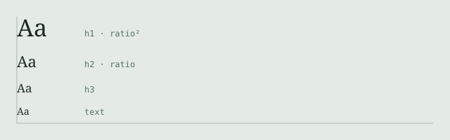
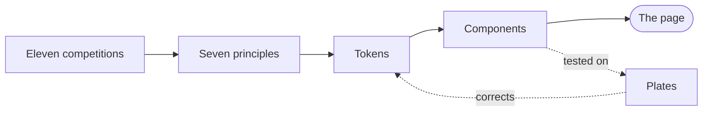

Everything reported here is fact from the awarding bodies or the trade press. The principles drawn from it at the end are a derivation: no jury publishes a palette, and no citation names a typeface. What the juries do publish is what they weighed, and that is enough to set type by.

## Best Book Design from all over the World 2026

Announced 12 March 2026 and awarded at the [Leipzig Book Fair](https://www.stiftung-buchkunst.de) on 20 March. Around 570 books from 33 nations were reviewed at the German National Library in Leipzig by Sunandini Banerjee, Artur Frankowski, Fraser Muggeridge, Isabel Seiffert and Raül Vicent.[^jury] Only books that have **already won a national competition** are eligible, which makes this the *single highest-signal* book design award. The measure is set once, as `--md-measure`, and the <abbr title="Type Directors Club">TDC</abbr> now awards medals in ~~four~~ three disciplines. Press <kbd>⌘</kbd><kbd>K</kbd> to search; the ==Goldene Letter== is the top prize.

Fourteen prizes are awarded in a fixed structure: one Goldene Letter, one Gold, two Silver, five Bronze and five Honorary Appreciations.

### Goldene Letter

*Ourouboros Wings*, designed by Benaiah French at the Royal Academy of Art, The Hague. 207 × 294 mm, 160 pages, 200 copies, self-published.[^dutch] The jury citation is the most useful sentence in the whole survey: the design lets the boundary between content and form blur, folding the printed sheets so that colour fields migrate into the interior of the Japanese binding.

#### Formats

Nine of the fourteen prizewinners are under 230 mm on the long edge, and one is 50 × 68 mm.

##### Read the formats column

Small format means a short measure and small type carried by generous margins.

###### Jury

Banerjee, Frankowski, Muggeridge, Seiffert, Vicent.

### Bronze Medals

| Work | Design | Country | Width | Height | Pages |
|:--|:--|:--|--:|--:|--:|
| *Heatwave* | Bänziger, Florio, Kasper | Switzerland | 165 | 220 | 264 |
| *Collapsed Mythologies* | Dayna Casey | Netherlands | 142 | 225 | 344 |
| *Anthology for Listening, Vol. II* | Linn Henrichson | Denmark | 270 | 163 | 400 |
| *Mountain 239* | Shin Sohyun | South Korea | 50 | 68 | 288 |
| *Os Ovários das Papoilas* | Macedo Cannatà | Portugal | 145 | 100 | 112 |

: The five Bronze Medals, with formats as reported by Stiftung Buchkunst. Dimensions in millimetres.

Read the formats column. The dominant register in the most prestigious book design award on earth is small, which means a short measure and small type carried by generous margins, not the wide, large-type default of most Markdown renderers.

## Type Directors Club, TDC72

Winners were announced on 20 July 2026 in Brooklyn. This year is a structural change: the first Type-High awards introduced Gold, Silver and Bronze above the long-standing Certificate of Merit.[^typehigh]

| Tier | Awarded | Share |
|:--|--:|--:|
| Gold | 13 | 8.2% |
| Silver | 26 | 16.4% |
| Bronze | 28 | 17.6% |
| Certificate of Merit | 92 | 57.9% |

: TDC72 Type-High medals and Certificates across the three disciplines.

## What the juries rewarded

Reading across all eleven competitions, seven principles recur. They are the transferable part.

7. Legibility under load. Both of the year's top prizes reward type that has to work.
8. Small is the professional register.
9. Nine. Here is where alignment usually breaks.
10. Ten. The periods share a column and the figures stack.
11. Variable fonts with optical sizing are the new baseline. The TDC type categories are now organised by axis count:
    a. single style
    b. single axis
    c. multiple axis
    d. superfamily

- Type area before typeface. The column and its margins are the design.
  - One spot colour, used structurally: a numeral, a rule, a reference mark.
    - Rules are hairlines and horizontal. No boxes, no fills.
- Depth by style, not by size.

- [x] Type area settled
- [x] Spot colour chosen
- [ ] Face licensed

Satzspiegel
:   The type area: the block of set text on the page, and its relationship to the four margins. The first thing a book jury looks at.

Measure
:   Line length, counted in characters. Under 80 for sans, a little more for serif.

Optical size
:   A variable-font axis that adjusts stroke contrast and spacing for the size at which type is set.

> They treat signs, typefaces and typography as cultural, social and political facts, and position graphic design as research and as the mediation of forms.
>
> <cite>Jury citation, Jan Tschichold Award 2026, to Coline Sunier and Charles Mazé</cite>

> [!NOTE]
> The alert tone is one custom property per severity, so a project can add its own without touching the component.

> [!WARNING]
> Justified setting is off by default; enable it only where hyphenation is active.

---

## Principle one as CSS

The column is made by padding the container, not by capping each child. A `ch` resolves against the element's own font size, so a measure set on every block gives a page one left edge per type size.

```css
/* one measure, resolved once, at body size */
.md {
  padding-inline: max(2ch, calc((100% - var(--md-measure)) / 2));
}

@container md-host (min-width: 62rem) {
  .md > figure,
  .md > pre { margin-inline: calc(var(--md-bleed) * -1); }
}
```

Rhythm as a function. Every vertical space in the set is a multiple of its return value.

```{.javascript .numberLines}
const unit = "rhythm";
const rhythm = (leading, size) => leading * size;
// every vertical space is a multiple of one unit
export const space = {
  item: rhythm(1.62, 19) * 0.25,
  block: rhythm(1.62, 19),
  section: rhythm(1.62, 19) * 2,
};
```



## From citation to stylesheet

A diagram is drawn when the page is rendered and arrives as an image, so the file stays one file and opens offline.



[^jury]: The jury reviewed the entries at the German National Library, 19 to 21 February 2026. Catalogue designed by Lamm & Kirch.
[^dutch]: It had already won the Dutch national competition. The Netherlands has now taken the Goldene Letter repeatedly, including 2025 for *Forget Me Not*.
[^typehigh]: Named and designed by Graham Clifford, TDC life member and Chairman Emeritus. Totals: 13 Gold, 26 Silver, 28 Bronze, 92 Certificates.
